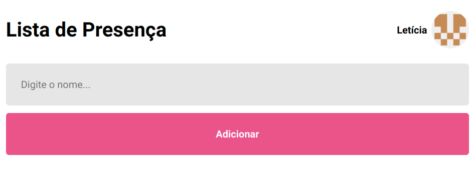

  <a href="#-tecnologias">Tecnologias</a>&nbsp;&nbsp;&nbsp;|&nbsp;&nbsp;&nbsp;
  <a href="#-projeto">Projeto</a>&nbsp;&nbsp;&nbsp;|&nbsp;&nbsp;&nbsp;
  <a href="#-como-rodar">Como rodar</a>&nbsp;&nbsp;&nbsp;|&nbsp;&nbsp;&nbsp;
  <a href="#-como-contribuir">Como contribuir</a>&nbsp;&nbsp;&nbsp;
  

 

  

## Lista de Presença

## 🚀 Tecnologias

Esse projeto foi desenvolvido com as seguintes tecnologias:

- [REACT](https://reactjs.org/)
- [NPM](https://www.npmjs.com/)
- [JavaScript](https://developer.mozilla.org/pt-BR/docs/Web/JavaScript) 
- [HTML5](https://developer.mozilla.org/pt-BR/docs/Web/HTML/HTML5) 
- [CSS3](https://developer.mozilla.org/pt-BR/docs/Web/CSS)

## 💻 Projeto

Aplicação em React para demonstrar alguns fundamentos.

Aula do canal [Rocketseat - discover](https://www.rocketseat.com.br/)

## 🚀 Como Rodar

- Clone o projeto.
- Abra o seu editor de código e entre na pasta reactapp.
- Use o terminal e execute npm install, em seguida npm run dev. Irá mostrar a porta onde será rodado o projeto.

## 🤔 Como contribuir

- Faça um fork desse repositório;
- Cria uma branch com a sua feature: `git checkout -b minha-feature`;
- Faça commit das suas alterações: `git commit -m 'feat: Minha nova feature'`;
- Faça push para a sua branch: `git push origin minha-feature`.

Depois que o merge da sua pull request for feito, você pode deletar a sua branch.

## 📝 Licença

Esse projeto está sob a licença MIT.